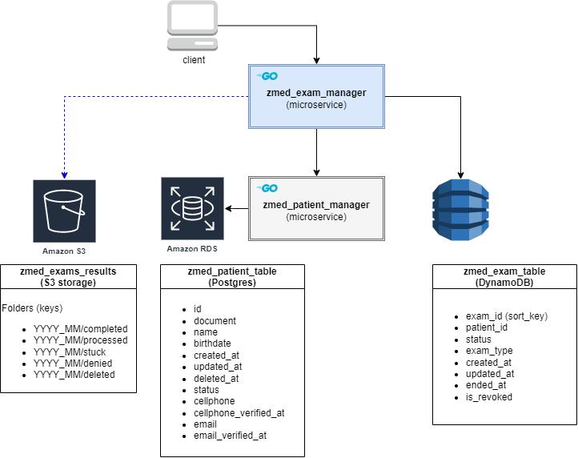

# microservice zmed_exam_manager
This is a golang microservice study case that manages exam's registry.
It makes part of a software architecture with microservices and AWS infrastructure prepared to handle exams for the fictional "ZMED" company.

## ZMED exams's architecture diagram

#### microservices
 - **zmed_exam_manager** (Golang): manages exams registry in a dynamoDB table.
 - **zmed_patient_manager** (Golang): manages patient's registry in a RDS(Postgres).

#### storage
- **zmed_exam_table** (DynamoDB): Stores exam's registry.
- **zmed_patient_table** (RDS): Stores patient's registry.
- **zmed_exams_results** (S3): Stores exam's results.


## Endpoints
### Register a new exam request
- path: "/exam/new"
- method: Post
- headers: none
- params: none
- body: 
  - document (string): patient's document
  - exam_type (int): the exam code
> An attendant allows a patient to undergo a medical examination. The patient's document and the type of exam to be performed are informed.
The microservice makes a request to zmed_patient_manager. If the patient is not active or the exam code does not exist, it returns an error.
The medical exam record is persisted with status "Registered" in dynamoDB and the microservice returns its body as responseDTO on success.
-----
### Get exams from a patient
- path: "/exams/info"
- method: Get
- headers: none
- params: 
  - document (string): patient's document
- body: none
>All exams for a patient are returned from dynamoDB. The attendant only needs to inform the patient's document.
----
### Register that an exam has started
- path: "/exam/start"
- method: Post
- headers: none
- params: nome
- body: 
  - document (string): patient's document
  - exam_id (string): uuid id from the exam
  - exam_type (int): the exam code
> The attendant responsible for performing the exam informs the document, the exam id registered and the type of exam to be performed. 
> If the exam is not registered, it will return an error. 
> The exam is updated in dynamoDB for "Started" status. 
> Returns a serialized JWT token that must be inserted into the exam result paper which will be uploaded to the S3 bucket to be processed.
-----
### Send a text message or an email to a patient that his/her exam is ready.
- path: "/exams/communicate"
- method: Post
- headers: none
- params: nome
- body:
  - exam_token (string): JWT token with exam's info
  - result_token (string): JWT token with the exam's result info
> The test results will normally be processed by goroutines. 
> This endpoint is used for cases where an exam result was not processed automatically and there is a need for an attendant to inform it manually. 
> The request must contain the exam token and the exam result token. 
> Both tokens are then deserialized. Returns an error in case of data inconsistency. 
> In case of success, the exam is updated with status "Finished" in dynamoDB, then it searches for the user's contact in zmed_patient_manager and sends a text message or email informing that the exam has been finished.
-----
## Parallel processing
> Every time an exam is uploaded to the S3's "/completed" folder a goroutine will pull this exam and process it. 
> If successful, the goroutine performs the same steps as the "/exams/communicate" endpoint. 
> In case it cannot handle the exam tokens, it will update the status in dynamoDB to "Stuck" and move the file from the "/completed"  to "/stuck" folder.
> If there is any inconsistency with the patient, the exam is moved to the "/denied" folder. If the exam has "Revoked" status in dynamoDB, the result is moved to the "/deleted" folder.

## Uploading exam results
> The exam results must be uploaded in the "/completed" folder. 
> Every exam result must contain the exam_token generated by the "exam/start" endpoint and the result_token generated by the exam execution team, in addition to the normal exam template that will be sent to the patient.
The S3 folder path is organized by year, month and process (i.e. "zmed_exams_result/2022_08/completed" ).
# Installation
### Environment Variables
```azure
ZMED_DYNAMO_EXAM_MANAGER_TABLE_NAME=zmed_exam_table
ZMED_S3_BUCKET=zmed_exams_result
ZMED_S3_COMPLETED_KEY=completed
ZMED_S3_PROCESSED_KEY=processed
ZMED_S3_STUCK_KEY=stuck
ZMED_S3_DENIED_KEY=denied
ZMED_S3_DELETED_KEY=deleted
ZMED_PATIENT_MANAGER_HOST=http://localhost:80
ZMED_JWT_KEY=zmedKey
```
### Running locally
A simple way to get started is to 
1. download this repository:
```
git clone https://github.com/yuripiffer/zmed_exam_manager.git
```
2. Export the environment variables listed above.
3. Run the zmed_patient_manager microservice.
4. Create in your AWS account a dynamoDB table with an "exam_id" sort key and a folder named "zmed_exams_result" in your S3 bucket or run localstack in your Docker.

## License
This is an open-source and free software release.
